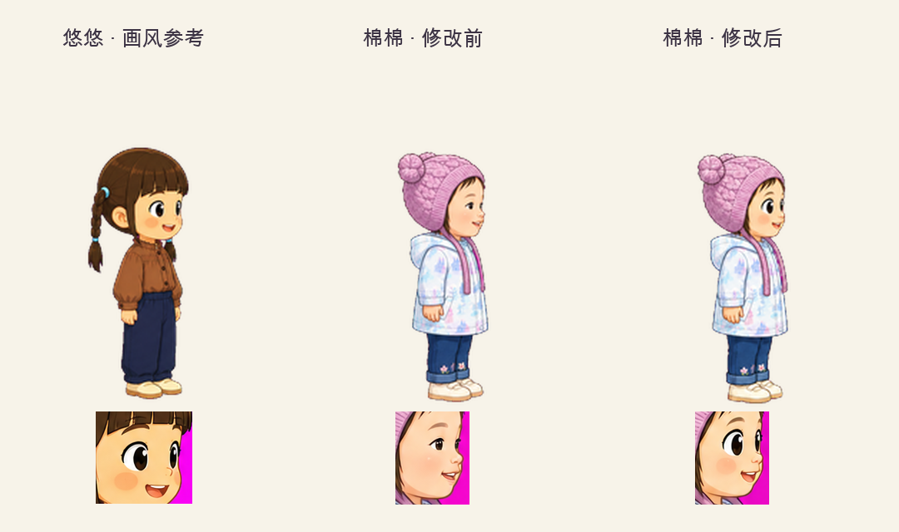

# 棉棉大眼睛画风校正

> 2026-08-31 · CR-20260831-mianmian-big-eyes · `youyou-eyes-v2`

## PM Review Slice

- 本阶段关键决策：参考悠悠，使用更大更圆的眼睛、清晰眼白与深色圆瞳孔、简洁脸部阴影；七组动作同步，保留棉棉的粉紫针织帽、浅蓝外套、裤脚花纹与原身高。
- 被放弃的方案：仅放大选择页头像、只改待机、复制悠悠的服装或发型、修改角色身高或玩法参数。
- 需要 PM 确认的问题：无；用户查看修改对比后回复“好的”，已确认 `youyou-eyes-v2` 版本。
- 不需要 PM 审查的执行细节：抠色阈值、脚底锚点、素材路径、ZIP、帧校验和与共享缩放。
- 进入下一阶段的条件：本次不自动推进产品阶段；整体 Phase 4B 审查仍按原门禁执行。

## 对比

## 结果与验证

- 内置 image_gen 分别编辑7张动作原图，generate2dsprite 处理28帧、透明合图与GIF；提示词随各动作保存。
- 继续使用同一256px格子、0.8共享缩放与[128,231]脚底锚点；待机可见高度仍为175px。全包最大比例漂移3.984%，未超过8%门槛。
- 7组/28帧透明、非空、无边缘裁切和无粘贴截断；眨眼、惊讶与庆祝情绪保留。
- 现有角色选择专项11/11通过，覆盖五种窗口、棉棉三个玩法、结算、重玩和换玩法。
- 独立预览七动作均可切至第4帧，半速、深色背景、左右翻转正常，无控制台错误。摄像头路径仅模拟就绪。
- 原版完整素材备份在 `changes/backups/lilac-girl-before-big-eyes-20260831.zip`；本次未修改HTML运行时或其他角色。
