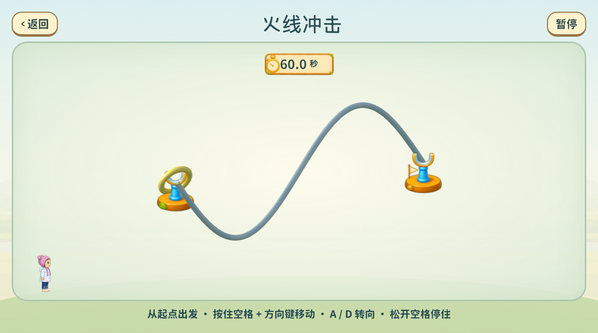

# 火线冲击首版试玩审查

2026-09-05 · QA-TARGETED · 实现与自动验证完成 / pending_pm

原游戏地址启动后选择第四卡“火线冲击”。操作：Space握住、方向键移动、A/D转向；先直轨练习，再60秒S弯挑战。摄像头进入玩法后需握稳校准。

## PM Review Slice

- 本阶段关键决策：固定S弯、真实空间圆环、一次碰线/超时结束；松手不停表；暂停转练习；成功局独立升序用时榜。
- 被放弃的方案：自动吸附/转向、二维圆图假旋转、沿用三颗心、全项目换引擎。
- 需要 PM 确认的问题：圆环与火线边界清楚吗；移动/转腕/重握是否顺手；失败反馈是否温和；实摄及儿童难度尚未验证。
- 不需要 PM 审查的执行细节：模块拆分、误差界、锚点、纹理细分、存储去重与Worker释放。
- 进入下一阶段的条件：自动核心14/14、新浏览器14/14和旧回归通过，可进入真实试玩；专属蜂鸣与新字形品牌子集待补。

完整测试和未验证边界见根目录`火线冲击-开发日志与交接.md`。本轮未确认旧整体Phase 4B或旧L1参考图。
